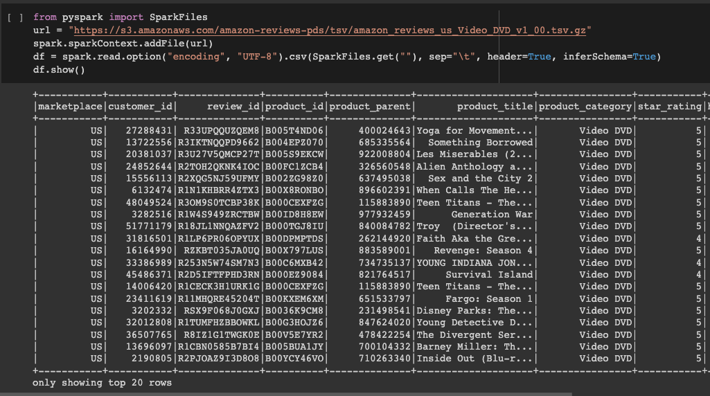
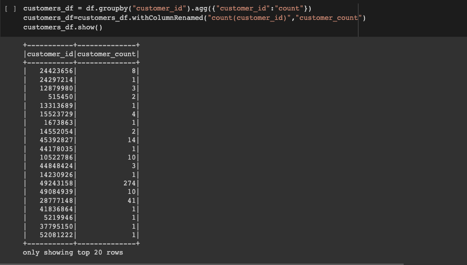
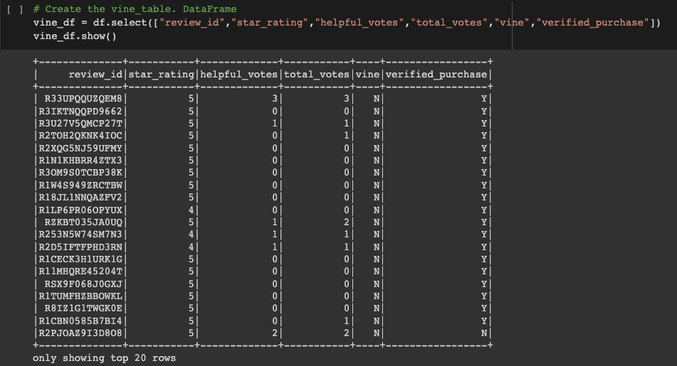
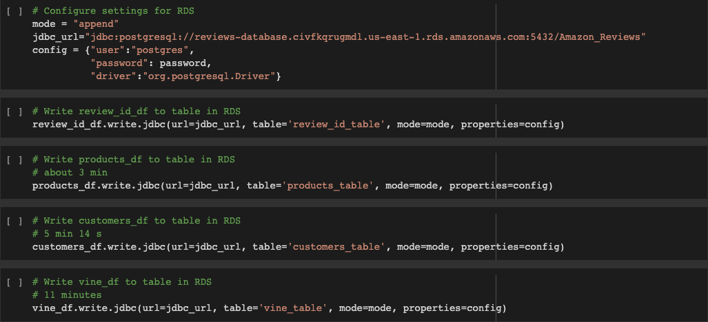
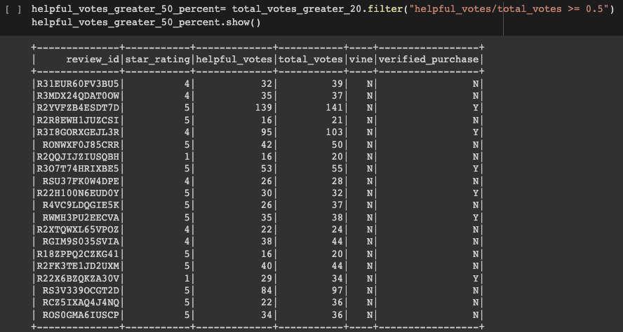
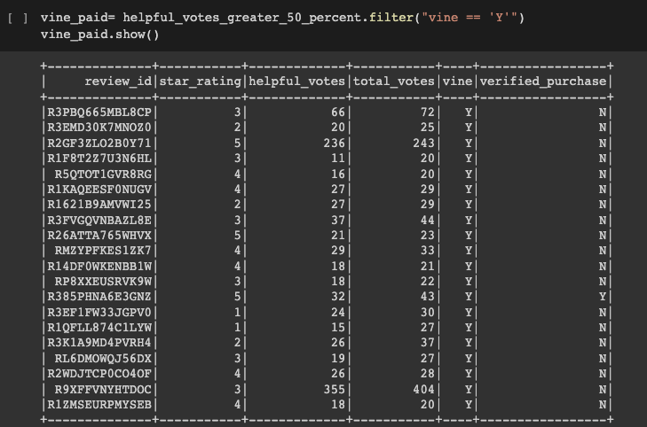
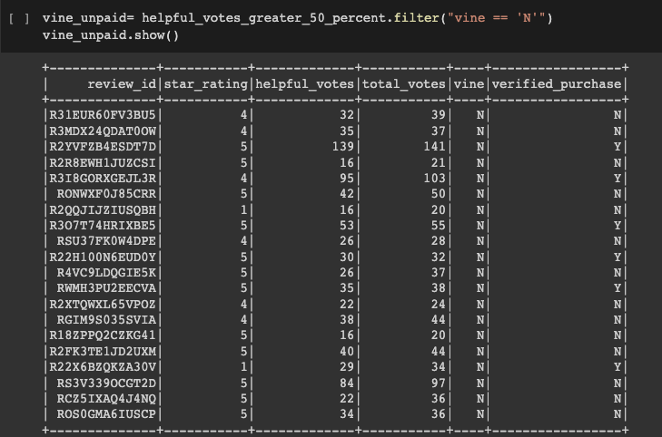
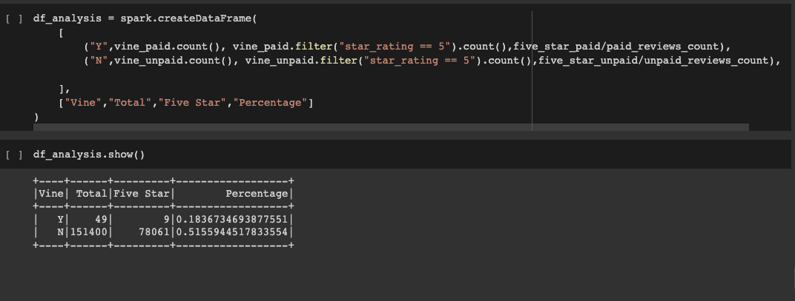
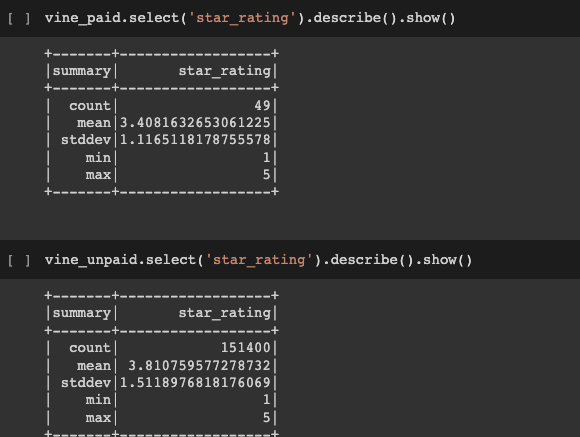

# Amazon Vine Analysis
## Project Overview 

**Big Market** specializes in helping business improve their marketing strategies by inspecting, transforming, and analyzing their data so that their clients can make informed business decisions. The companies that request Big Market services are usually large companies that deal with *Big Data*.  Unlike traditional data, Big Data exceeds the power of regular relational databases. 

Certain characteristics attributed to Big Data are referred to as the “Five Vs”.  According to [Teradata](https://www.teradata.com/Glossary/What-are-the-5-V-s-of-Big-Data#:~:text=Big%20data%20is%20a%20collection,variety%2C%20velocity%2C%20and%20veracity.), they are defined as:

-   Volume: data’s size 
-   Value:  data’s pertinence and usefulness 
-   Variety: refers to data’s different forms such as, structured, semi-structured, and raw data
-   Velocity: speed of incoming information and how companies store and manage data
-   Veracity: data’s reliability 

Therefore, for this project, I utilized AWS web services to create a Relational Database in the AWS cloud (RDS) to be able to manage large quantities of data. I also used Google Colab Notebooks and PySpark to analyze and process the data. 

Big Market’s current project is to analyze Amazon reviews written by members of the paid [Amazon Vine program]( https://www.amazon.com/vine/about). The vine program selects reviewers to share their unbiased opinion on a variety of products from different brands selling on the Amazon store. Companies provide their products free of charge to members of the vine program so that they can share and publish their experience in the review section. I will analyze a dataset containing Video DVD Amazon Reviews to determine if there’s any positivity bias from Vine members in the dataset. The findings will be shared with **SellBy**, a company that sells its products on the Amazon platform.

## ETL on Amazon Product Reviews

I first performed an ETL process on the dataset. I extracted the dataset from the Amazon Program and loaded it into the Google Colab Notebooks using PySpark.

I transformed the dataset into four DataFrames to be loaded into the PostgreSQL database. The DataFrames I created were: **customers_df**,  **products_df**,  **review_id_df**, and **vine_df**.

Here are two DataFrame samples:

I used the following code to load all the DataFrames into the AWS RDS instance and their corresponding tables in PgAdmin. After the DataFrames were successfully exported into the AWS RDS instance, I perfomed the Vine Analysis. 

## Determining Bias of Vine Amazon Reviews

I decided to use PySpark to determine if there was any positivity bias in the five-star reviews that were part of the Amazon Vine Program.
According to the paper [“Positivity Bias in Customer Satisfaction Ratings,”](https://dl.acm.org/doi/fullHtml/10.1145/3184558.3186579#:~:text=A%20consumer%20is%20more%20likely,systematically%20biased%20for%20several%20reasons.) star ratings in customer reviews usually have a *J-shaped distribution,* where ratings gravitate towards the extreme positive or extreme negative. Some reasons for the positive ratings are that customers already purchased the article or service and tend to have a more favorable opinion. Furthermore, there’s also a social influence bias from already existing positive reviews. Therefore, it is important to analyze this dataset where there are some reviews that belong to a paid program, to see if having a paid vine affects the review.
 

First, I filtered the data to create a new DataFrame retrieving the rows where the total votes were equal to or greater than 20 votes. This was done to prevent division by zero errors. I also filtered the DataFrame to get all the rows where the number of helpful votes divided by total votes was equal to or greater than 50%.
Here’s the table after applying both filters.

I also created two more DataFrames, one showing all the rows where the written review was part of the vine program, and the other showing the rows where the reviews were not part of the vine program. 

After having the two DataFrames, I was able to determine that there were only 49 reviews in the vine paid program and 151,400 reviews that were not part of the vine program. 

To show the findings, I created the following DataFrame.

From the 49 paid reviews, only 9 reviews were five-stars. This means that five-star reviews were only ≈ 18.37% of the paid reviews. However, from the 151,400 unpaid reviews, 78,061 were five-stars showing that unpaid five-star reviews were approximately 51%.

## Summary
The analysis highlights that it is unlikely that there was a positivity bias in this specific dataset. Approximately 18% of the reviews in the paid vine program were five-star reviews; this suggests that people participating in the program are keeping their reviews honest and unbiased. In contrast, there might be some positivity bias in the unpaid vine reviews since five-star reviews were more than 50%.  

I also applied some descriptive statistics on the paid and unpaid vine to gain more insights. 

The star rating mean for the paid vine is ≈3.4 stars, and the star rating mean for the unpaid vine is ≈3.8 stars. This demonstrates again that there could be some bias in the unpaid vine.  

Some other analysis we could perform on this data would be to find the percentage of combined 4-star and 5-star paid reviews compared to the percentage of combined 1-star and 2-star paid reviews to see if reviews lean towards the extreme positive or extreme negative. 

My final recommendation to SellBy is to keep participating in the vine program to obtain more data. This analysis returned only 49 paid reviews out of the initial 5,069,140 reviews, so having more data would be helpful  to further analyze and identify possible positivity bias.  
