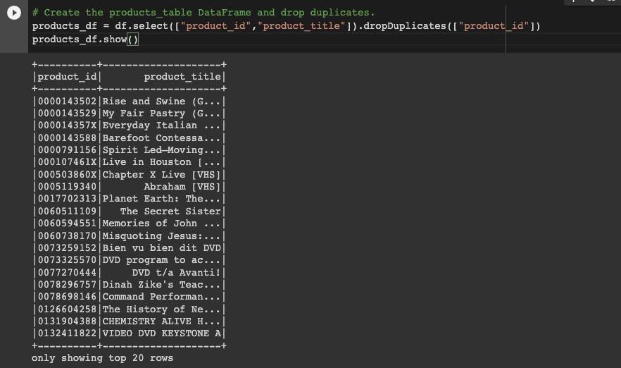
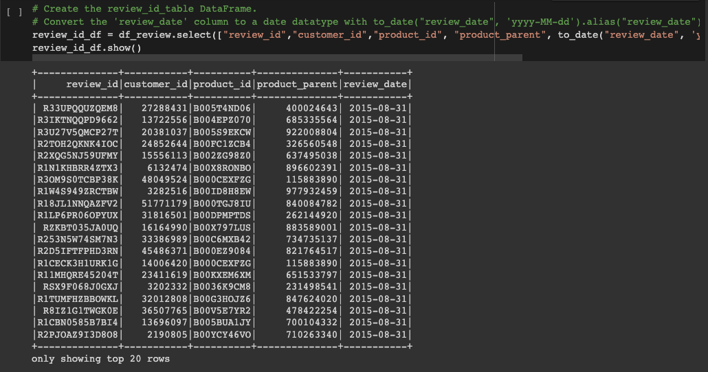

# Amazon Vine Analysis
## Project Overview 

**Big Market** specializes in helping business improve their marketing strategies by inspecting, transforming, and analyzing their data so that their clients can make informed business decisions. The companies that request Big Market services are usually large companies that deal with *Big Data*.  Unlike traditional data, *Big Data* exceeds the power of regular relational databases. 

Certain characteristics attributed to Big Data are referred to as the  “Five Vs”.  According to [Teradata](https://www.teradata.com/Glossary/What-are-the-5-V-s-of-Big-Data#:~:text=Big%20data%20is%20a%20collection,variety%2C%20velocity%2C%20and%20veracity.), they are defined  as:

-   Volume: data’s size 
-   Value:  data’s pertinence and usefulness 
-   Variety: refers to data’s different forms such as, structured, semi-structured, and raw data
-   Velocity: speed of incoming information and how companies store and manage data
-   Veracity: data’s reliability 

Therefore, for this project, I utilized AWS web services to create a Relational Database in the AWS cloud (RDS) to be able to manage large quantities of data and used Google Colab Notebooks and PySpark to analyze and process the data. 

Big Market’s current project is to analyze Amazon reviews written by members of the paid Amazon Vine program.  This program selects reviewers to share their unbiased opinion on a variety of products from different brands selling on the Amazon store. Companies provide their products free of charge to members of the vine program so that they can share and publish their experience in the review section. 

I will analyze a dataset containing Video DVD Amazon Reviews to determine if there is any positivity bias from Vine members in the dataset. Finally, I will share my findings with  **SellBy** Stakeholders.

## ETL on Amazon Product Reviews

I first performed an ETL process on Amazon Reviews to analyze the data. I extracted the dataset from the Amazon Program and loaded it into the Google Colab Notebooks using PySpark.

I transformed the dataset into four DataFrames to be loaded into the PostgreSQL database. The DataFrames I created were: **customers_df**,  **products_df**,  **review_id_df**, and **vine_df**.

I used the following code to load all the DataFrames into the AWS RDS instance to their corresponding tables in PgAdmin. After the DataFrames were successfully exported into the AWS RDS instance through PgAdmin, I was able to perform the Vine Analysis. 

## Determining Bias of Vine Amazon Reviews

I decided to use PySpark to determine if there was any positivity bias in the 5-star reviews that were part of the Amazon Vine Program.
According, to the paper “Positivity Bias in Customer Satisfaction Ratings,” star ratings in customer reviews usually have a *J-shaped distribution,* where ratings gravitate towards the extreme positive or extreme negative. Some reasons for the positive ratings are that customers already purchased the article or service and tend to have a more favorable opinion; there’s also social influence from already existing positive reviews. Therefore, it is important to analyze this dataset where there are some reviews that belong to a paid program and observe if having a paid vine affects the outcome.
 

